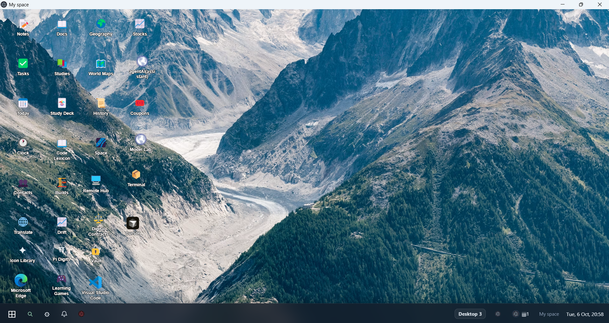

# MySpaceOS

I built MySpaceOS to have a single place where I can gather all the projects and applications I build, and create protocols between them.

## Description

It runs as an operating system layer on Windows. You get a real desktop (icons, taskbar, virtual desktops), dozens of apps and services I built, and protocols so those internal systems can pass data and call each other. There is also a shell language and runtime for longer automation.

## Screenshot

## Getting Started

### Dependencies

- Windows 10 or 11
- Download the `.exe` and you’re good. if you want to run from the code: Node.js (LTS)

### Installing

**installer**

1. Go to https://github.com/yonatamnyuval1-stack/MySpaceOS/releases/latest
2. Download the .exe
3. run it and finish the setup

### Executing

Open MySpaceOS from the Start menu or the desktop shortcut.
When you're inside:
You'll see many apps inside already (mainly intended for daily use), and if you click the Myspace electron icon (the one located to the right of the switch desktop button), a list of dozens of built-in services in the operating system will be displayed (such as a browser, AI chat, etc.).

## Help

Demo (screenshots): https://yonatamnyuval1-stack.github.io/MySpaceOS/demo/
Installer again: https://github.com/yonatamnyuval1-stack/MySpaceOS/releases/latest

## Authors
Jonathan Jacob

## License
MIT